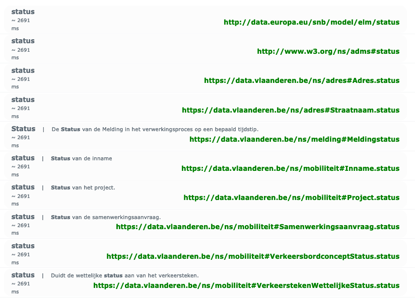

# Notes

<!-- TOC -->
* [Aanbod](#aanbod)
  * [Class](#class)
  * [Properties](#properties)
    * [beleidsdomein](#beleidsdomein)
    * [beschrijving](#beschrijving)
    * [categorie](#categorie)
    * [doelgroep](#doelgroep)
    * [infrastructuur](#infrastructuur)
    * [intake](#intake)
    * [gerealiseerdDoor](#gerealiseerddoor)
    * [maxAantalDeelnemers](#maxaantaldeelnemers)
    * [medium](#medium)
    * [subcategorie](#subcategorie)
    * [taal](#taal)
* [IndividueelAanbod](#individueelaanbod)
  * [Class](#class-1)
  * [Properties](#properties-1)
* [GroepsAanbod](#groepsaanbod)
  * [Class](#class-2)
  * [Properties](#properties-2)
    * [minAantalDeelnemers](#minaantaldeelnemers)
* [Activiteit](#activiteit)
  * [Class](#class-3)
  * [Properties](#properties-3)
    * [aanbod](#aanbod-1)
    * [aantal aanmeldingen](#aantal-aanmeldingen)
    * [aantal inschrijvingen](#aantal-inschrijvingen)
    * [annulatie reden](#annulatie-reden)
    * [infrastructuur](#infrastructuur-1)
    * [naam](#naam)
    * [status](#status)
    * [subActiviteit](#subactiviteit)
    * [superActiviteit](#superactiviteit)
    * [tijdschema](#tijdschema)
    * [vervangen door](#vervangen-door)
    * [vervangt](#vervangt)
* [Sessie (subclass of Activiteit)](#sessie-subclass-of-activiteit)
  * [Class](#class-4)
  * [Properties](#properties-4)
* [Sessiereeks (subclass of Activiteit)](#sessiereeks-subclass-of-activiteit)
  * [Class](#class-5)
  * [Properties](#properties-5)
* [Doelgroep](#doelgroep-1)
  * [Class](#class-6)
  * [Properties](#properties-6)
    * [kenmerk](#kenmerk)
* [DoelgroepKenmerk](#doelgroepkenmerk)
  * [Class](#class-7)
  * [Properties](#properties-7)
    * [deel van](#deel-van)
    * [kenmerktype](#kenmerktype)
    * [waarde](#waarde)
* [GebruikteVTE](#gebruiktevte)
  * [Class](#class-8)
  * [Properties](#properties-8)
    * [aantal](#aantal)
    * [vteType](#vtetype)
* [Financiering](#financiering)
  * [Class](#class-9)
  * [Properties](#properties-9)
    * [bedrag](#bedrag)
    * [financieringstype](#financieringstype)
    * [gefinancierd door](#gefinancierd-door)
    * [karakter](#karakter)
    * [uitbetalingsdatum](#uitbetalingsdatum)
* [Financieringsbron](#financieringsbron)
  * [Class](#class-10)
  * [Properties](#properties-10)
    * [beleidsdomein](#beleidsdomein-1)
    * [financiert](#financiert)
    * [niveau](#niveau)
<!-- TOC -->

## Aanbod

### Class

Considered classes:

- http://purl.org/vocab/cpsv#PublicService
  - Definition: This class represents the service itself. A public service is the capacity to carry out a procedure and 
    exists whether it is used or not. 
    It is a set of deeds and acts performed by or on behalf of a public agency for the benefit of 
    a citizen, a business or another public agency.
  - This can only be used when "Aanbod" is considered public service.
  - The definition does not include non-citizens, while prisons might have non-citizens.
  - If we use it, I think that we should subclass it instead of saying that "Aanbod" is of the class PublicService.
- https://schema.org/Service
  - Definition: A service provided by an organization, e.g. delivery service, print services, etc.
  - Reusable properties:
    - schema:audience for "Doelgroep"
- https://schema.org/Offer
  - Definition: An offer to transfer some rights to an item or to provide a service — 
    for example, an offer to sell tickets to an event, to rent the DVD of a movie, to stream a TV show over the internet, 
    to repair a motorcycle, or to loan a book.
  - There is a relationship between schema:Service and schema:Offer via schema:offerCatalog.
- https://www.wikidata.org/wiki/Q161837
  - Definition: service provided by a government to people living within its jurisdiction
  - Can we consider an "Aanbod" to be provided by the government?

Decision: schema:Service

### Properties

#### beleidsdomein

- Nothing in schema.org
- Nothing via LOV

Decision: new property.

#### beschrijving
- dcterms:description
  - This one is used for all descriptions in OSLO I've seen so far.

Decision: use dcterms:description

#### categorie
- http://data.europa.eu/snb/model/elm/category
  - Definition: A category to which this specification belongs. 
    This property can be used instead of dc:type, if the category cannot provided via a controlled vocabulary.
  - ❌ Different scope.
- https://data.vlaanderen.be/ns/statistiek#categorie
  - Definition: De categorie waarvoor de probaliteit bepaald is.
  - ❌ Different scope.
- https://schema.org/category
  - Definition: A category for the item. Greater signs or slashes can be used to informally indicate a category hierarchy.
  - schema:Service is in the domain.
  - skos:Concept is in the range because the range is schema:Thing.
- https://www.bbc.co.uk/ontologies/creativework/category
  - ❌ 404
- http://www.agls.gov.au/agls/terms/category
  - ❌ 404

Decision: use schema:category

#### doelgroep

- https://schema.org/audience
  - Definition: An intended audience, i.e. a group for whom something was created.
  - Domain incl. Event and Service.
- https://data.vlaanderen.be/ns/cultuurparticipatie#Activiteit.doelgroep
  - ❌ Domain: http://www.cidoc-crm.org/cidoc-crm/E7_Activity

Decision: schema:audience

#### infrastructuur

- https://data.vlaanderen.be/ns/cultuurparticipatie#Activiteit.infrastructuur
  - ❌ "Aanbod" is not in the domain, only "Activiteit".
- https://schema.org/location
  - Definition: The location of, for example, where an event is happening, where an organization is located, or where an action takes place.
  - ❌ Domain: Action, Event, Organisation, InteractionCounter.
- https://www.w3.org/ns/prov#atLocation
  - Definition: A location can be an identifiable geographic place (ISO 19112), 
    but it can also be a non-geographic place such as a directory, row, or column. 
    As such, there are numerous ways in which location can be expressed, 
    such as by a coordinate, address, landmark, and so forth.
  - Domain: prov:Activity or prov:Agent or prov:Entity or prov:InstantaneousEvent
    - ❓ Is the domain ok here?
  - Range: prov:Location
    - ❓ Is the range ok here?

Decision: TODO

#### intake
- Nothing in schema.org 
- Nothing via LOV

Decision: new property.

#### gerealiseerdDoor
- http://cidoc-crm.org/cidoc-crm/P14_carried_out_by
  - Definition: This property describes the active participation of an instance of E39 Actor in an instance of E7 Activity.
  - ❌ Domain: Activity
  - Range: Actor
  - From OSLO Cultuurparticipatie.
- https://schema.org/provider
  - Definition: The service provider, service operator, or service performer; the goods producer. 
    Another party (a seller) may offer those services or goods on behalf of the provider. 
    A provider may also serve as the seller. Supersedes carrier.
  - Domain: Service

Decision: TODO

#### maxAantalDeelnemers
- Nothing in schema.org
- Nothing via LOV

Decision: new property.

#### medium
- https://schema.org/eventAttendanceMode
  - Definition: The eventAttendanceMode of an event indicates whether it occurs online, offline, or a mix.
  - ❌ Domain is only schema:Event and not schema:Service.

Decision: TODO

#### subcategorie
- Nothing in schema.org
- Nothing via LOV

Decision: new property.

#### taal
- https://schema.org/inLanguage
  - Definition: The language of the content or performance or used in an action.
  - ❌ Domain: Event, but not Service.
  - From OSLO Cultuurparticipatie
- http://purl.org/dc/terms/language
  - Definition: A language of the resource.

Decision: dcterms:language

## IndividueelAanbod

### Class
No existing classes found.

Decision: create new class.

### Properties

Doesn't have own properties.

## GroepsAanbod

### Class
No existing classes found.

Decision: create new class.

### Properties

#### minAantalDeelnemers

- Nothing in schema.org
- Nothing via LOV

Decision: new property.

## Activiteit

### Class

Note that we can subclass from multiple classes.

Considered classes:

- https://www.w3.org/ns/prov#Activity
  - Definition: An activity is something that occurs over a period of time and acts upon or with entities; 
    it may include consuming, processing, transforming, modifying, relocating, using, or generating entities.
  - This class is more for when an activity generates a result: she becomes a doctor (result) after graduation (activity).
- https://schema.org/Event
  - Definition: An event happening at a certain time and location, such as a concert, lecture, or festival. 
    Ticketing information may be added via the offers property. 
    Repeated events may be structured as separate Event objects.
  - Reusable properties:
    - schema:subEvent
    - schema:superEvent
    - schema:eventSchedule
    - schema:eventStatus
    - schema:inLanguage
    - schema:previousStartDate for an event that is rescheduled. The problem is that it's just a date and not dateTime.
- http://www.w3.org/ns/sosa/Actuation
  - Definition: An Actuation carries out an (Actuation) Procedure to change the state of the world using an Actuator.
  - ❌ Actuator is a device, so I think that it doesn't work for organisations and people.
- http://www.cidoc-crm.org/cidoc-crm/E7_Activity
  - Definition: This class comprises actions intentionally carried out by instances of E39 Actor that result in changes of state in the cultural, social, or physical systems documented.
    This notion includes complex, composite, and long-lasting actions such as the building of a settlement or a war, as well as simple, short-lived actions such as the opening of a door.
  - This class is a subclass of [E5 Event](https://cidoc-crm.org/html/cidoc_crm_v7.1.3.html#E5).
  - The definition reads like it aligns with the definition of prov:Activity.

Decision: schema:Event aligns best with Activity in our case.

### Properties

#### aanbod

- Nothing in schema.org
- Nothing in LOV

Decision: new property

#### aantal aanmeldingen

- Nothing in schema.org
- Nothing via LOV

Decision: new property.

#### aantal inschrijvingen

- Nothing in schema.org
- Nothing via LOV

Decision: new property.

#### annulatie reden
Decision: TODO

#### infrastructuur

Decision: TODO

#### naam

- http://purl.org/dc/terms/title
  - Definition: A name given to the resource.
  - Also used by OSLO Cultuurparticipatie
- https://schema.org/name

Decision: TODO

#### status

- The search results above show that a custom property is sometimes created/used in other APs, next to adms:status.
- http://www.w3.org/ns/adms#status
  - Definition: Links to the status of the Asset or Asset Distribution in the context of a particular workflow process.

Decision: adms:status because of the definition and because it's also used in other APs.

#### subactiviteit

- https://schema.org/subEvent
  - Definition: An Event that is part of this event. 
    For example, a conference event includes many presentations, each of which is a subEvent of the conference.
- https://data.vlaanderen.be/ns/cultuurparticipatie#Activiteit.subactiviteit

Decision: schema:subEvent because the class is schema:Event.

#### superactiviteit

- https://schema.org/superEvent
  - Definition: An event that this event is a part of. 
    For example, a collection of individual music performances might each have a music festival as their superEvent.
- https://data.vlaanderen.be/ns/cultuurparticipatie#Activiteit.superactiviteit

Decision: schema:superEvent because the class is schema:Event.

#### tijdschema

Decision: TODO

#### vervangen door

- http://purl.org/dc/terms/isReplacedBy
  - Definition: A related resource that supplants, displaces, or supersedes the described resource.
  - No domain or range.
  - Inverse of dcterms:replaces.

Decision: Definition fits and dcterms is stable.

#### vervangt

- http://purl.org/dc/terms/replaces
  - Definition: A related resource that is supplanted, displaced, or superseded by the described resource.
  - No domain or range.
  - Inverse of dcterms:isReplacedBy

Decision: Definition fits and dcterms is stable.

## Sessie (subclass of Activiteit)

### Class

Considered classes:

- https://schema.org/Event

Decision: model Sessie as new subclass of [Activiteit](#Activiteit).

### Properties

No own properties.

## Sessiereeks (subclass of Activiteit)

### Class

Considered classes:

- https://schema.org/Event

Decision: model Sessiereeks as new subclass of [Activiteit](#Activiteit).

### Properties

No own properties.

## Doelgroep

### Class

Considered classes:

- https://schema.org/Audience
  - Definition: Intended audience for an item, i.e. the group for whom the item was created.
  - The problem is that the properties of this group are stored as text.
  - We can work around this problem by adding our own properties and ignoring the existing property.
  - This class doesn't work if "Doelgroep" can also be used to limit who participates in an "Aanbod".
  - It directly connects with schema:Serivce.
- http://data.europa.eu/snb/model/elm/targetGroup
  - Definition: A specific target group or category for which this specification is designed.
  - ❌ Different scope.
- https://data.vlaanderen.be/ns/mobiliteit/#doelgroep
  - Definition: Groep of categorie die belang hebben bij de mobiliteitsmaatregel.
  - ❌ Different scope.

Decision: schema:Audience

### Properties

#### kenmerk

- Nothing in schema.org
- Nothing via LOV
- http://purl.org/dc/terms/hasPart
  - A related resource that is included either physically or logically in the described resource.
  - This property is an inverse property of dcterms:isPartOf.

Decision: dcterms:hasPart

## DoelgroepKenmerk

### Class

No existing classes found.

Decision: create new class.

### Properties

#### deel van

- http://purl.org/dc/terms/isPartOf
  - Definition: A related resource in which the described resource is physically or logically included.
  - This property is an inverse property of dcterms:hasPart.

Decision: dcterms:isPartOf

#### kenmerktype

- http://purl.org/dc/terms/type
  - This is used in other APs as well to denote a type.

Decision: dcterms:type

#### waarde

Decision: TODO

## GebruikteVTE

### Class

No existing classes found.

Decision: create new class.

### Properties

#### aantal

- http://data.europa.eu/snb/model/elm/count
  - ❌ Domain: Result Category

Decision: TODO

#### vteType

- http://purl.org/dc/terms/type
  - This is used in other APs as well to denote a type.

Decision: dcterms:type

## Financiering

### Class

Considered classes:

- https://schema.org/Grant
  - Definition: A grant, typically financial or otherwise quantifiable, of resources. 
    Typically a funder sponsors some MonetaryAmount to an Organization or Person, 
    sometimes not necessarily via a dedicated or long-lived Project, resulting in one or more outputs, or fundedItems. 
    For financial sponsorship, indicate the funder of a MonetaryGrant. 
    For non-financial support, indicate sponsor of Grants of resources (e.g. office space).
  - Reusable properties:
    - schema:funder
    - schema:sponsor
    - schema:fundedItem --> Organisation, Person, Product, and so on.
  - If we use schema:Event and schema:Service then schema:Grant makes more sense.
- http://purl.org/cerif/frapo/Funding
  - Definition: An amount of money available to finance some project or activity.
  - FRAPO ontology: "It can also be used to describe other types of projects, for example building projects and educational projects."
  - Reusable properties:
    - http://purl.org/cerif/frapo/supports
      - Definition: An object property linking an agent to something that the agent supports by financial or other means.
    - http://purl.org/cerif/frapo/funds (subproperty of frapo:supports)
      - Definition: An object property that links a grant to something that it funds (i.e. that it finances or pays for), or that links an agent providing funding to something that it funds.
- http://vivoweb.org/ontology/core#Grant
  - Doesn't look maintained.
- https://eurocris.org/ontologies/cerif/1.3#Funding
  - ❌ Page not found.
- https://rains-uoa.github.io/RAInS-Ontology/v2.0/index-en.html#Funding
  - Definition: A sao:InformationElement which records a specific piece of information detailing a funding source.
  - The ontology has a different scope: The RAInS ontology is an ex-tension of the System Accountability Ontology (SAO) 
    for the AI systems' domain by defining a set of concepts required to document the design and 
    implementation stage of such systems.

Decision: schema:Grant

### Properties

#### bedrag

Decision: TODO

#### financieringstype

- http://purl.org/dc/terms/type
  - This is used in other APs as well to denote a type.

Decision: dcterms:type

#### gefinancierd door

Decision: TODO

#### karakter

Decision: TODO

#### uitbetalingsdatum

Decision: TODO

## Financieringsbron

### Class

Considered classes:

- http://purl.org/dc/terms/Agent
  - The properties we want to add can be relevant for other organisations as well regardless of the fact that
    they are involved in funding.

Decision: TODO

### Properties

#### beleidsdomein

See Aanbod > beleidsdomein

Decision: new property.

#### financiert

Decision: TODO

#### niveau

- Nothing in schema.org
- Nothing via LOV

Decision: new property.
